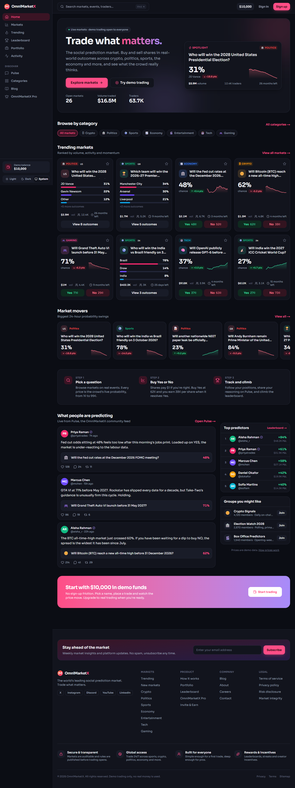
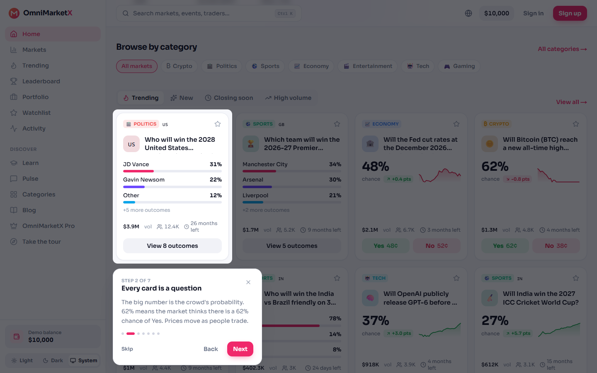
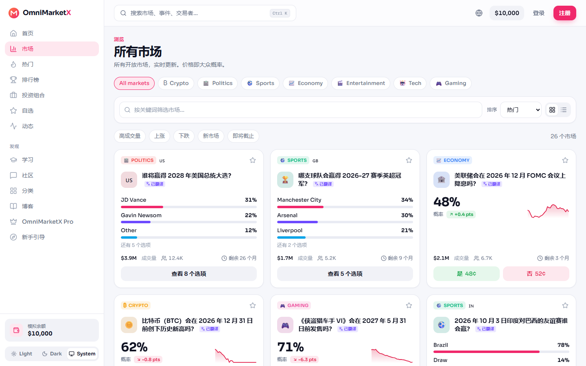
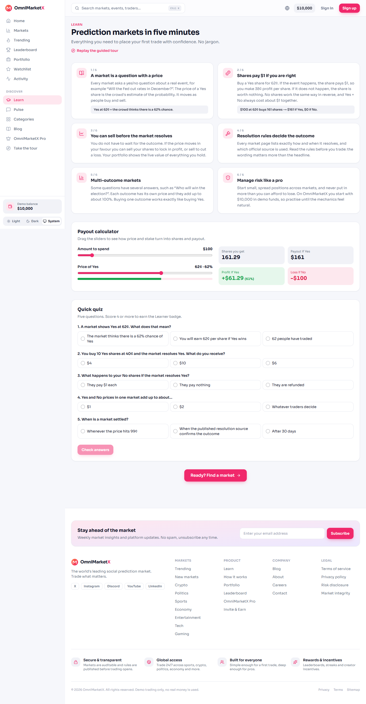
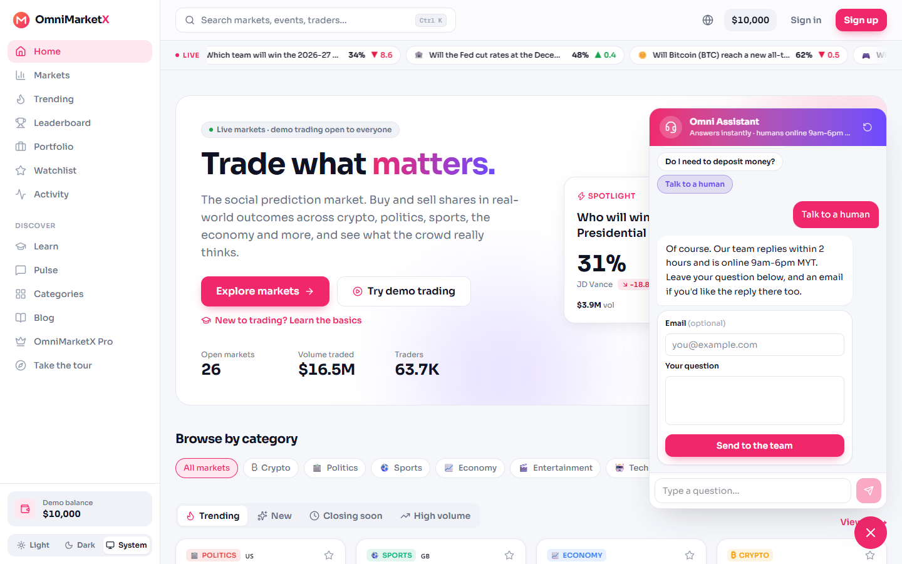
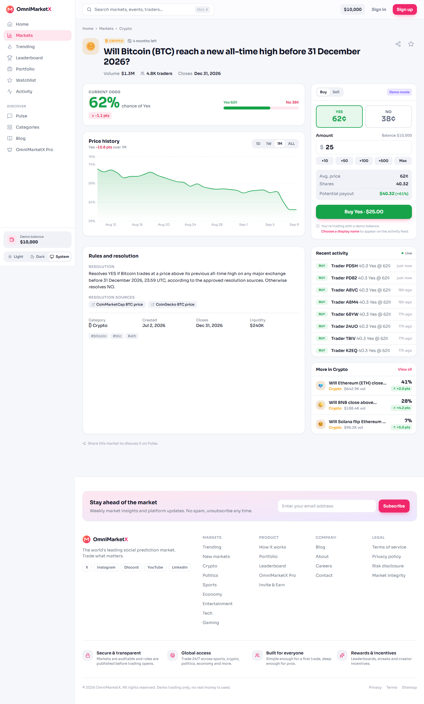
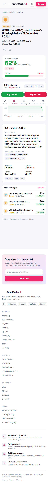
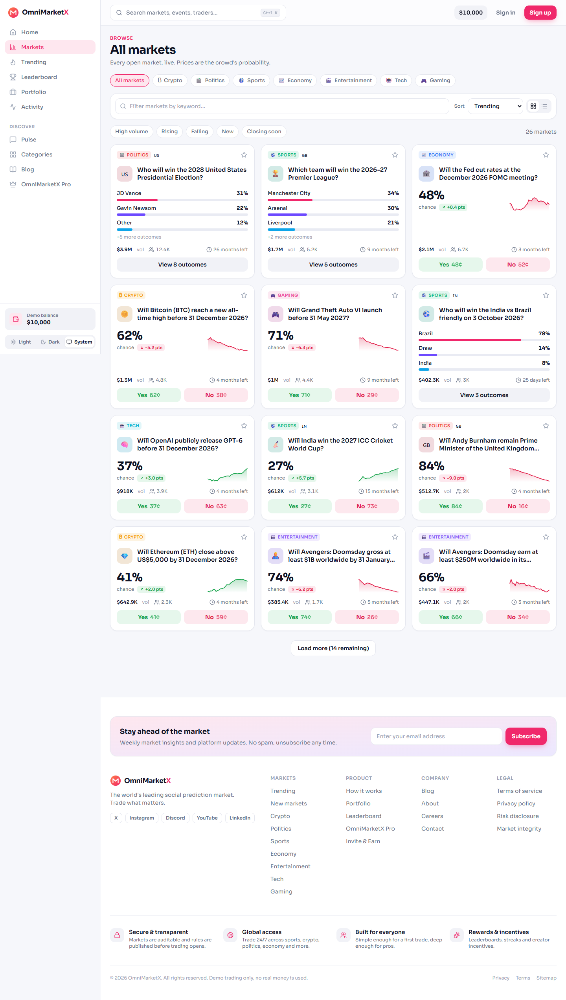

# OmniMarketX, redesigned

A redesign of [omnimarketx.com](https://www.omnimarketx.com/home), the social prediction market, built for the OmniMarketX product evaluation by **Ananya Gupta**.

The brief was: *take the existing product and make it better.* I used the live site as a new user, wrote down every problem I hit, and fixed each one. I also built the ideas from my own product test report, including the support chatbot.

| | |
|---|---|
| **Live demo** | _add your deployment URL here_ |
| **Code** | https://github.com/anya-xcode/omnimarketx |
| **Built with** | Node.js, React (Next.js 16), TypeScript, Tailwind CSS. No database needed. |
| **Tested with** | 37 unit tests, 21 browser tests on desktop and phone, screenshots of every page |



---

## 1. What I found on the live site

I opened the current site on a laptop (1440px) and a phone (390px) and tried every main flow as a first-time user.

| Problem | Where | Why it matters |
|---|---|---|
| A full-screen "Loading OmniMarketX…" spinner on every page | Every page | The first thing a visitor sees is a spinner. Search engines see it too. |
| Cards show "Vol $0", "0 traders", "+0%" | Home, Markets | Numbers that never change teach people to ignore them. |
| Market titles mix Chinese and English in the same grid, and there is no language setting | Markets | If you cannot read the title, nothing else on the page matters. |
| Nothing explains what a prediction market is or what "62¢" means | Whole site | A new user does not know what to do first. |
| Trading needs an account before you can try anything | Market page | People leave when they are asked to sign up before they trust the app. |
| On the phone, the Buy panel is the last thing on the page, under the footer | Market page | The most important button is the hardest to reach. |
| Two "Sort" controls, category chips cut off, cards of different heights | Markets | Looks unfinished, and hidden controls are never used. |
| The support chat could not answer "how can I start?" or "explain me that platform" and sent everything to a human with no reply time | Chat widget | These are the first questions every new user asks. |
| Only one theme, sidebar content dumped under the footer on mobile, chat and Feedback tabs overlapping content | Whole site | Small things that add up to "not production ready". |

Before screenshots: [home](docs/screenshots/reference-home-before.png), [market page](docs/screenshots/reference-market-before.png).

---

## 2. What I changed

### 2.1 Guided steps for new users

**Problem:** after sign-up you land on a page full of numbers with no explanation.

**Fix:** a guided tour that opens on the first visit and points at the real screen.

- 8 steps: welcome, "every card is a question", "buy Yes or No", search, portfolio, language and theme, the support assistant, done.
- Keyboard works (arrow keys, Escape). It remembers that you finished it.
- Can be replayed any time from **Take the tour** in the sidebar or from the Learn page.



### 2.2 Choose your language, at sign-up and any time

**Problem:** Chinese and English titles side by side, no way to change language.

**Fix:** a language field in the sign-up box and a globe button in the top bar. Four languages: English, 中文, Bahasa Melayu, हिन्दी.

- The whole site changes: menus, buttons, market cards, trade panel, portfolio, tour, Learn page and chatbot.
- Every market title is translated. Example: *Will the Fed cut rates at the December 2026 FOMC meeting?* becomes *美联储会在 2026 年 12 月 FOMC 会议上降息吗？* with a small **Translated** tag. Hover to see the original.
- English and Chinese are complete. Malay and Hindi cover menus and the main screens and fall back to English elsewhere.



### 2.3 A Learn page for people new to trading

**Problem:** nothing on the site explains the basics.

**Fix:** a **Learn** page at `/learn` with:

- Six short lessons in plain words: a market is a question with a price; shares pay $1 if you are right; you can sell early; how markets are settled; markets with many options; managing risk.
- A calculator: drag the amount and the price and see shares, payout, profit and loss. Example: *$100 at 62¢ buys 161 shares → $161 if Yes, $0 if No.*
- A five-question quiz that awards a Learner badge.
- Available in English and Chinese.



### 2.4 Light and dark theme

- Dark theme by default. **Light** and **System** are one click away in the sidebar and in the phone menu. The choice is saved.
- Both themes use the same design tokens, so every screen was designed for both.

### 2.5 The support chatbot from my product test report

**Problem (from my report):** the live chat could not answer basic questions and always offered a human, with no idea of when that human would reply.

**Fix:** a support assistant on every page, built exactly as I proposed.

- **Opens with buttons**, so nobody has to guess what the bot understands: *How do I start? · What is OmniMarketX? · How does demo trading work? · Do I need to deposit money? · How do I deposit or withdraw? · How do the social and market features work? · Talk to a human.*
- **13 written answers matched first.** Typed questions are matched by keywords. Both questions the live bot failed on now get real answers. *"How can I start?"* returns three steps: pick a market, tap Yes or No, watch it in Portfolio.
- **Every answer ends with "Read more"** to the right page (Learn, Portfolio, Leaderboard, policies), so short answers are not dead ends.
- **"Talk to a human" is one option among several.** It says *"Our team replies within 2 hours and is online 9am–6pm MYT"* before taking your question, and it saves the question with the chat history.
- If nothing matches, it suggests the closest questions instead of guessing.
- Works in English and Chinese. All answers live in one text file, so adding a question is writing, not coding.



### 2.6 Faster pages, no spinner

- Pages arrive from the server already filled with markets. There is no loading spinner.
- A market that does not exist returns a real 404 page, not a normal page with an error inside.
- The chart is loaded only when needed, fonts are self-hosted, icons are trimmed to the ones used.

### 2.7 Trade without an account

- Every visitor gets a **$10,000 demo balance** immediately. Buy or sell on any market, and the price moves as you trade.
- "Sign in" is just choosing a display name and language. No email, password or wallet.
- The **Portfolio** page shows balance, open positions, profit and loss, a breakdown by category, and trade history.



### 2.8 Market page that works on a phone

- Desktop: the trade panel stays on the right while you scroll.
- Phone: a fixed **Buy Yes 62¢ / Buy No 38¢** bar sits above the bottom menu and opens a trade sheet. No more scrolling under the footer.
- A real price chart with 1 day, 1 week, 1 month and all-time views, and per-option lines for markets like *Who will win the 2028 US election?*
- A live **Recent activity** list of trades on that market, related markets, and the full rules and resolution source.



### 2.9 Markets page that is easy to scan

- Cards show real volume, number of traders, 24-hour change and time left, with a small price line.
- Yes/No cards and multi-option cards are the same height, so the grid lines up.
- One filter bar: search, sort, quick filters (High volume, Rising, Falling, New, Closing soon) and a grid/list switch. Filters live in the URL, so `/markets?category=crypto&sort=volume` can be shared.
- Category chips scroll with a fade and arrows instead of being cut off.



### 2.10 Small things that make it feel finished

- Live price ticker on the home page, a spotlight market, tabs for Trending / New / Closing soon / High volume, market movers.
- Working watchlist: star a market and it appears in the sidebar with its live price and on a Watchlist page.
- Search from anywhere with **Ctrl K**.
- A thin progress bar while a page is loading.
- No side scrolling on any page on a 390px phone screen. Skip link, labelled controls, keyboard focus, reduced-motion support.
- Proper empty states, toasts for every action, share button, legal pages, favicon, social preview image, sitemap.

---

## 3. Try it yourself

1. Open the site. The tour starts by itself. Use **Next** or the arrow keys.
2. Click the globe in the top bar and choose **中文**. Watch the titles change. Switch back to English.
3. Open **Markets**, pick **Crypto**, type *bitcoin* in the filter. Open the Bitcoin market.
4. Tap **Yes**, enter 50, and press **Buy Yes**. The price moves and the trade appears under Recent activity.
5. Open **Portfolio** to see the position and profit or loss. Star a market and open **Watchlist**.
6. Open **Learn**, drag the calculator, take the quiz.
7. Click the chat bubble bottom-right. Press **How do I start?**, then type *explain me that platform*, then press **Talk to a human**.
8. Change the theme in the sidebar.

---

## 4. How I tested it

- **37 unit tests** for pricing maths, positions, filtering, number formatting, and the chatbot matcher (including the two questions the live bot failed on and paraphrases such as *"is it free or do I have to deposit money"*).
- **21 browser tests** with Playwright, run on a desktop Chrome profile and a phone profile. They cover the home page, filtering by URL, placing a demo trade and seeing it in the portfolio, the watchlist, the tour, switching to Chinese, the quiz, the chatbot up to the human hand-off, the API, and the 404 page.
- **Screenshots** of every page at 1440px and 390px, light and dark, English and Chinese, compared by eye with the live site.
- **Scripts** that check every page at 390px for side scrolling and for browser console errors. Both are zero.
- A **server-vs-browser text check** that found a real bug: the server printed *$1.0M* and the browser *$1M*, which broke loading on the Markets page. Fixed and covered by a test.
- Lint, TypeScript strict checks and a production build all pass.

```bash
npm run check      # lint + types + unit tests
npm run test:e2e   # browser tests (start the production server first)
```

---

## 5. Run it locally

No database is needed. The app ships with its own sample data and saves demo trades, watchlists, names and support tickets to a local file (`.data/state.json`).

```bash
npm install
npm run dev        # http://localhost:3000
```

Optional settings in `.env.local` (all `.env*` files are git-ignored):

```bash
NEXT_PUBLIC_SITE_URL=http://localhost:3000   # public URL for link previews
# MONGODB_URI=mongodb://...                    # optional: same code switches to MongoDB
# OMX_DATA_FILE=off                            # optional: keep demo state in memory only
```

## 6. Deploy

1. Import the repo into Vercel (or any Node host).
2. Set `NEXT_PUBLIC_SITE_URL` to the public URL. Nothing else is required.
3. Deploy.

On Vercel, demo trades are kept in server memory and can reset after the server has been idle; every page still works. On a normal Node server they are saved to the file. Set `MONGODB_URI` if you want a database.

---

## 7. Known limitations

- Market data is sample data. Prices move only through demo trades.
- Sign-in is a demo: a display name only, no password.
- Malay and Hindi cover menus and the main screens; other text falls back to English.
- Market title translations ship with the sample data rather than coming from a translation service.
- With more time: comments under each market, price alerts for starred markets, live price refresh while a page is open, and a post box with market, image and poll attachments like the live feed.

---

## 8. How the code is organised

```
src/app/                 pages and API routes (Node route handlers under app/api)
src/components/          layout, market, home, learn, onboarding (tour), support (chatbot), ui
src/lib/repo.ts          the one place pages and API read data from (file store or MongoDB)
src/lib/pricing.ts       quotes, price impact, probabilities (pure functions, unit-tested)
src/lib/i18n/            dictionaries for en / zh / ms / hi and the translate helpers
src/lib/support-match.ts chatbot question matching (unit-tested)
src/data/seed.ts         the 26 sample markets, feed, traders, groups, blog
src/data/translations.ts market title translations
src/data/support-faq.ts  the chatbot's questions, answers and read-more links
tests/                   unit tests (Vitest)
e2e/                     browser tests (Playwright)
docs/screenshots/        before and after screenshots
```

---

Built by Ananya Gupta for the OmniMarketX evaluation, September 2026.
