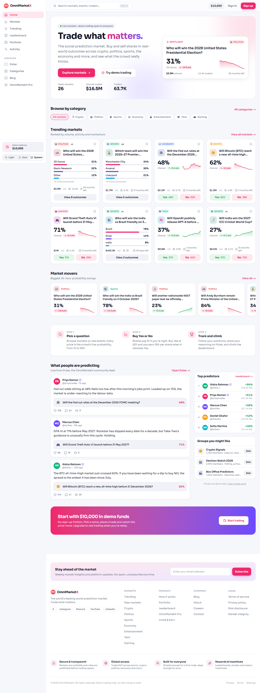

# OmniMarketX — product redesign

A ground-up redesign of [omnimarketx.com](https://www.omnimarketx.com/home), the social prediction market, built for the OmniMarketX product evaluation.
The brief was “take the existing product and make it better”. This repo is my answer: the same product, rebuilt as a faster, cleaner, mobile-first app with a working demo-trading loop, on a Node + React + MongoDB stack.

| | |
|---|---|
| **Stack** | Next.js 16 (React 19, App Router) · TypeScript · Tailwind CSS v4 · Node route handlers · MongoDB (Mongoose) · Zustand · Recharts · Vitest · Playwright |
| **Live demo** | _add your deployment URL here_ |
| **Screenshots** | [`docs/screenshots/`](docs/screenshots/) (before/after, light/dark, desktop/mobile) |



---

## 1. What I found in the current product

I audited the live site on desktop (1440px) and mobile (390px), read the rendered DOM, and tried every primary flow. The recurring themes:

| Area | Issue on the live site | Why it matters |
|---|---|---|
| **First load** | Every page bails out to client-side rendering and shows a full-screen “Loading OmniMarketX…” spinner before any content. | Slow perceived load, poor Core Web Vitals, and crawlers see a spinner instead of markets. |
| **Data presentation** | Cards show `Vol $0`, `0 traders`, `+0%` and `+0.00%` everywhere; “Trending Now” is a list of hashtags with `+0%`. | Numbers that never change teach users to ignore them. Empty metrics make a live market feel dead. |
| **Markets page** | Sort control is duplicated (inline *and* in the sidebar); category chips overflow with no scroll cue (the “Tech” chip is cut off); quick-filter chips look like labels, not controls; multi-outcome cards are taller than binary cards so the grid never aligns; “1 traders”. | Inconsistent UI erodes trust, and hidden controls are controls nobody uses. |
| **Market page** | Primary action (trade) requires an account; on mobile the trade panel is the *last* thing on the page, below the rules and footer; chart is a flat line with no data. | The most important action is the hardest to reach. |
| **Mobile** | The right-hand sidebar (hashtags, groups) is dumped *below the footer*; a stray “Authentication required” toast; chat widget and “Feedback” tab overlap content. | Mobile is where most social-product traffic comes from. |
| **Navigation** | Search opens a blank `/search` page; theme switch is a dropdown at the bottom of the sidebar; no keyboard shortcuts despite showing a `/` hint. | Discoverability and speed for returning users. |
| **Consistency** | Flags as emoji inside titles, inconsistent title casing, mixed languages in one card, “View Options” vs “YES/NO” affordances. | Small things, but they add up to “not production ready”. |

## 2. What I changed and why

### Experience
- **Server-rendered, no spinner.** Every page streams real content from the server. Home revalidates every 30s, listings are dynamic, market pages are always fresh. A missing market returns a real HTTP 404 (the loading skeleton is scoped so it can't mask a 404 with a 200).
- **Demo trading for everyone.** Visitors get a $10,000 demo balance immediately (anonymous session cookie). You can buy and sell on any market, and every trade moves the price with a small liquidity-based impact model, pushes a point onto the chart, and updates volume, trader count and the movers list. “Sign in” is just picking a display name.
- **Trade panel that is always reachable.** Sticky side rail on desktop; on mobile a fixed “Buy Yes 62¢ / Buy No 38¢” bar sits above the bottom nav and opens a bottom-sheet trade panel with quote, shares, potential payout and ROI.
- **Real charts.** Recharts price history with 1D / 1W / 1M / ALL ranges, per-outcome toggles for multi-outcome markets, and a tooltip. Sparklines on every card so momentum is visible at a glance.
- **Command-palette search** (`Ctrl/⌘ K` or `/`) across markets, traders and pages, with keyboard navigation. Legacy `/search?q=` links redirect into the filtered markets browser.
- **Markets browser with URL state.** Category, keyword, sort and quick filters live in the URL (shareable, back-button friendly). One sort control, scrollable category rail with fade + arrows, grid/list toggle (remembered), skeletons while filtering, an honest empty state, and “Load more (N remaining)”.
- **Consistent cards.** Binary and multi-outcome markets share the same card frame (header / title / body / stats / actions), so the grid always aligns. Titles clamp to two lines; flags and categories are badges, not emoji in the headline.
- **Meaningful numbers.** 24h change in probability points with direction colour, volume, traders, time-to-close, and a “Market pulse” gauge on Trending derived from real movement.
- **Mobile-first shell.** Collapsible sidebar → drawer, bottom tab bar, no horizontal overflow on any page (verified by script at 390px), safe-area padding, touch-sized targets.
- **Dark mode done properly.** Design tokens for both themes, system-aware, no flash, persisted, theme-colour meta for the browser chrome.
- **Accessibility.** Skip link, landmark roles, labelled controls, `aria-pressed`/`aria-current` states, focus rings, reduced-motion support, tabular numerals, unique form ids (the mobile sheet and desktop rail don't collide).
- **Polish everywhere.** Empty states with a next action, toasts for every mutation, share button (native share / clipboard), watchlist star, newsletter form with validation, legal pages, 404 and error boundaries, OG image and favicon, sitemap and robots.

### Engineering
- **Node API** under `/api/*` (markets, market detail, trades, portfolio, session, watchlist, feed, search, leaderboard, newsletter, health) with a consistent `{ ok, data | error }` envelope, validation and cache headers.
- **MongoDB via Mongoose**, with a repository layer (`src/lib/repo.ts`) that is the single place pages and API routes read from. If `MONGODB_URI` is not set, the same repository runs on an in-memory seed store, so the app always works and tests never need a database.
- **Idempotent auto-seeding.** An empty database is seeded with upserts on first request, safe under concurrent build workers. `npm run seed` resets it.
- **Deterministic seed data.** 26 markets across 7 categories (mostly the real questions from the live site, with realistic prices/volumes), 90 days of generated price history that lands exactly on today's price, feed posts, traders, groups and blog posts.
- **Pure domain logic** (`pricing.ts`, `positions.ts`, `market-query.ts`, `format.ts`) with unit tests, used identically by the server, the API and the client.
- **Hydration-safe by construction.** Time-relative text is marked, localStorage is read through `useSyncExternalStore`, and compact number formatting is hand-rolled because Node and Chrome ICU disagree (`$1.0M` vs `$1M`), which was producing a real hydration error until it was caught by the e2e run.
- **Performance.** Server components by default, the chart is code-split and client-only, icons are tree-shaken, fonts are self-hosted via `next/font`, images use AVIF/WebP, security headers set. Home responds in ~70ms locally on a warm server.

## 3. Running it

```bash
npm install
cp .env.example .env.local        # set MONGODB_URI, or leave it unset to use the in-memory store
npm run dev                       # http://localhost:3000
```

Useful scripts:

| Script | What it does |
|---|---|
| `npm run build && npm start` | Production build and server |
| `npm run seed` | Reset MongoDB to the canonical seed dataset |
| `npm run check` | Lint + typecheck + unit tests |
| `npm run test` | Vitest unit/component tests (32 tests) |
| `npm run test:e2e` | Playwright smoke tests on desktop + mobile (needs a production server, or set `E2E_BASE_URL`) |

`GET /api/health` reports whether the app is on `mongodb` or `memory` storage.

## 4. Deploying

1. Create a free MongoDB Atlas cluster and copy the connection string.
2. Push this repo to GitHub and import it into Vercel (or any Node host).
3. Set the environment variables `MONGODB_URI` and `NEXT_PUBLIC_SITE_URL` (your public URL).
4. Deploy. The database seeds itself on the first request.

## 5. Project structure

```
src/
  app/                 routes (App Router), API route handlers under app/api
  components/
    layout/            shell: sidebar, top bar, command palette, mobile nav, auth modal, footer
    market/            market card / row, browser, chart, trade panel, workspace
    home/, feed/, pricing/, ui/
  lib/
    repo.ts            data access (MongoDB or in-memory), trade execution
    models/            Mongoose schemas
    pricing.ts         quotes, price impact, primary outcome, change calculations
    market-query.ts    filtering/sorting/pagination (pure)
    positions.ts       trade → position aggregation (pure)
    history.ts         deterministic price-history generator
    session.ts         anonymous demo session cookie
  data/seed.ts         canonical dataset
  store/               Zustand client state (session, toasts)
tests/                 Vitest
e2e/                   Playwright
scripts/seed.ts        DB seeding CLI
docs/screenshots/      before/after captures
```

## 6. Trade-offs and what I would do next

- **Auth is intentionally lightweight** (anonymous cookie + display name). Wiring a real provider (email/OAuth, wallet connect) slots in behind `session.ts` without touching pages.
- **Filtering happens in the repository after a coarse Mongo query** (category, text). At this data size that is the simplest correct approach; at scale the sort/paginate step moves into the aggregation pipeline and `history` moves to its own time-series collection.
- **Leaderboard periods** scale the seed stats; a production version aggregates settled trades.
- **Next:** real-time price updates over SSE/WebSocket, comments on markets, market creation flow, notifications, i18n for the Malaysian/Chinese-language markets on the live site, and Lighthouse CI in the pipeline.

---

Built by Twinkle Shah for the OmniMarketX evaluation, September 2026.
